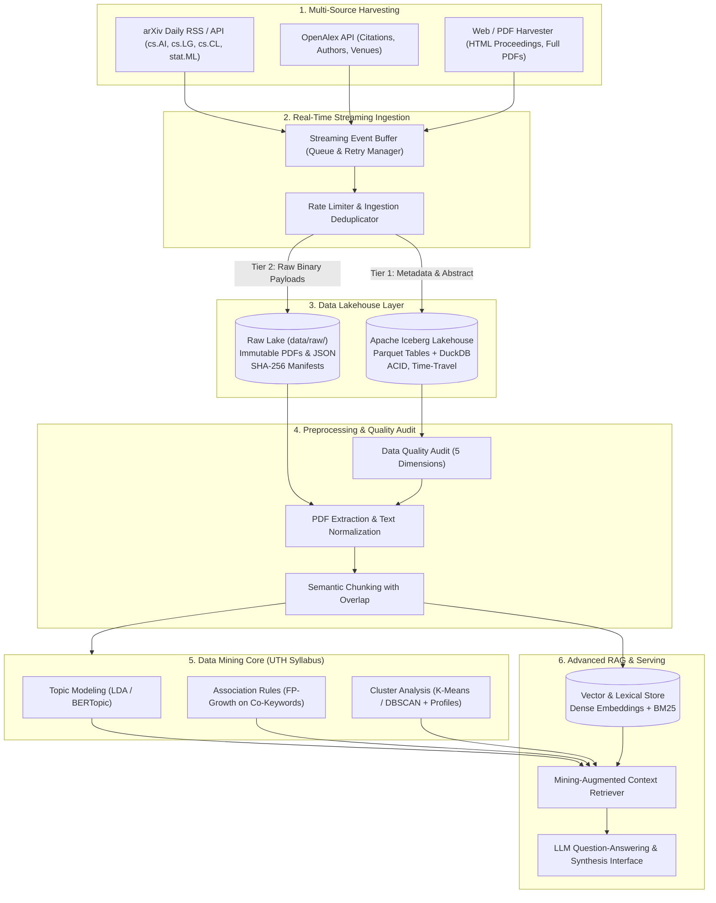

# UTH Data Mining: Real-Time Scientific Data Mining & Advanced RAG System for AI/DS

> **Đề tài:** *Khai thác dữ liệu nghiên cứu khoa học thời gian thực hướng tới xây dựng hệ thống truy xuất tri thức nâng cao (RAG) cho miền AI/DS.*  
> **Course:** Data Mining (Trường Đại học Giao thông Vận tải TP.HCM — UTH)  
> **Advisor / Instructor:** TS. Trần Thế Vinh  
> **Reference Standards:** [docs/references/ML_PIPELINE_REFERENCE_v4.md](docs/references/ML_PIPELINE_REFERENCE_v4.md), [docs/references/Chapter1.pdf](docs/references/Chapter1.pdf), [docs/references/Chapter2.pdf](docs/references/Chapter2.pdf), [docs/references/Chapter4.pdf](docs/references/Chapter4.pdf)

- **Motivation/Background**: Academic publications in AI and Data Science are accelerating exponentially. This project implements a real-time data mining pipeline that continuously harvests newly published scientific literature across multiple sources (PDF, HTML, APIs), streams raw payloads into an Apache Iceberg lakehouse, and prepares clean semantic data for an Advanced Retrieval-Augmented Generation (RAG) system and exploratory pattern discovery.
- **Purpose**: Serve as the canonical repository entry point, real-time data mining architecture map, lakehouse schema reference, and operational manual.
- **Overview Pipeline**: Follows CRISP-DM, KDD, and modern Lakehouse design: Multi-Source Crawling → Streaming Event Queue → Apache Iceberg Lakehouse + Immutable Raw Vault → Data Quality Auditing → Preprocessing & Chunking → Data Mining (Topics, Clusters, Association Rules) → Advanced Hybrid RAG.
- **Detailed Plan**: §1 Project Vision & Scope; §2 End-to-End System Architecture; §3 Repository Structure; §4 Research Phases; §5 Installation & Setup; §6 Governance & Rules.
- **References**: [agents/rules/AGENT_AI.md](agents/rules/AGENT_AI.md), [agents/rules/MD_CONVENTION.md](agents/rules/MD_CONVENTION.md), [docs/references/ML_PIPELINE_REFERENCE_v4.md](docs/references/ML_PIPELINE_REFERENCE_v4.md).
- **Created**: 2026-07-25T00:00:00+07:00
- **Last Updated**: 2026-09-30T13:01:59+07:00

---

## 🎯 1. Project Topic & Scope: Real-Time Scientific Paper Mining for RAG

The core objective is to automate the discovery, ingestion, and mining of cutting-edge AI and Data Science research to empower knowledge retrieval and deep domain synthesis:

```text
┌────────────────────────────────────────────────────────────────────────────────────────┐
│                        CORE END-TO-END PIPELINE PHASES                                │
│                                                                                        │
│   [1. Multi-Source Harvesters]  ──►  [2. Streaming Queue]   ──►  [3. Iceberg Lakehouse] │
│       arXiv RSS/API, OpenAlex          Event Buffer & Retry         ACID Tables + Vault│
│                                                                          │             │
│                                                                          ▼             │
│   [6. Advanced RAG System]      ◄──  [5. Data Mining Core]  ◄──  [4. Preprocessing]   │
│       Hybrid Dense+Sparse Search       Topics, Clusters, Rules      Chunking & Cleaning│
└────────────────────────────────────────────────────────────────────────────────────────┘
```

### Key Functional Pillars:

1. **Multi-Source Real-Time Harvesting:**
   - **arXiv Ingestion:** Daily automated harvesting of new preprints across `cs.AI`, `cs.LG`, `cs.CL`, and `stat.ML` via arXiv RSS and REST API.
   - **OpenAlex Integration:** Harvesting scholarly entity metadata, author institutions, citation graphs, and open-access links.
   - **Two-Tier Ingestion Strategy:** Instantly ingest paper metadata & abstracts for sub-second availability, while streaming full PDF downloads and text extraction asynchronously in the background.
2. **Streaming Event Queue & Rate Limiting:**
   - Decoupled event buffering to manage rate limits, handle connection retries, and ensure resilient ingestion without losing incoming publication bursts.
3. **Data Lakehouse Architecture (Apache Iceberg + DuckDB):**
   - **Immutable Raw Lake (`data/raw/`):** Preserves original PDFs, HTML dumps, and JSON payloads with cryptographic SHA-256 provenance manifests.
   - **Analytical Lakehouse:** Uses **Apache Iceberg** table format (via PyIceberg) with **DuckDB** for ultra-fast columnar SQL queries, partition pruning, schema evolution, and historical time travel.
4. **Data Mining Core (UTH Course Syllabus):**
   - **Topic Modeling:** Discovering emerging research themes over time via LDA and BERTopic.
   - **Association Rule Mining:** Extracting co-occurring research concepts, keywords, and methodologies via FP-Growth (`mlxtend`).
   - **Cluster Analysis:** Partitioning research frontiers and author networks using K-Means and DBSCAN with formal Cluster Profiles.
5. **Advanced RAG Engine:**
   - Semantic text cleaning, formula/table handling, and sliding-window chunking.
   - Hybrid retrieval combining dense semantic embeddings (Sentence-Transformers) and sparse lexical search (BM25) with cluster-aware reranking.

---

## 🏗️ 2. End-to-End System Architecture



Key engineering guarantees:
- **Script-Only Training:** All training loops live in `src/training/*.py` or `src/experiments/*.py`. Notebooks never train.
- **Full-State Resumability:** Runs persist model, optimizer, scheduler, RNG state, config, and metrics per [agents/rules/LOGGING_CHECKPOINT_RULES.md](agents/rules/LOGGING_CHECKPOINT_RULES.md).
- **5W1H Empirical Context:** Every reported metric carries full 5W1H context per [agents/rules/RESULTS_REPORTING.md](agents/rules/RESULTS_REPORTING.md).
- **Strict Separation of Governance vs Memory:** Immutable constitutional rules live in [`agents/`](agents/), while evolving research notes, phase specifications, and experiment logs live in [`docs/`](docs/).

---

## 📁 Repository Structure

The template supports both **Single-Track** (default monolithic layout shown below) and **Multi-Track / Feature-Modular** layouts (for multi-lab coursework or modular research tracks). See [agents/rules/CREATE_FOLDER_STRUCTURE_TEMPLATE.md](agents/rules/CREATE_FOLDER_STRUCTURE_TEMPLATE.md) for full principles and placement rules.

```text
Uth-Data-Mining/
├── agents/                    # Constitutional AI Governance (Immutable rules & templates)
│   ├── README.md              # Governance navigation guide
│   ├── rules/                 # Binding standards (AGENT_AI, FOLDER_STRUCTURE, MD, etc.)
│   └── templates/             # Reusable skeletons (BUG, AUDIT, EXP, PHASE, PROGRESS)
│
├── docs/                      # Evolving Project Research & Memory (Global)
│   ├── README.md              # Master research index
│   ├── PURPOSE.md             # Project brief & locked success criteria
│   ├── OVERVIEW.md            # Living roadmap indexing all tracks/phases
│   ├── shared/                # Universal SOPs (HOW_TO_SETUP_AI_AGENT, HANDOFF_TEMPLATE)
│   ├── phases/                # Pipeline phase technical specifications
│   ├── progress/              # Live phase status tracking (*_STATUS.md)
│   ├── experiments/           # Experiment plans and comparative writeups
│   ├── bugs/                  # Resolved and active bug reports
│   └── references/            # Reusable technical guides (Git, Optuna, etc.)
│
├── configs/                   # Configuration files (YAML)
│   └── config.yaml.example    # Configuration skeleton
│
├── data/                      # Dataset assets (ignored in git)
│   ├── raw/                   # Immutable raw inputs (papers/*.pdf, raw_html/, metadata/)
│   ├── lakehouse/             # Apache Iceberg tables (metadata, chunks, metrics)
│   └── processed/             # Cleaned splits and extracted features
│
├── src/                       # Maintained Python packages
│   ├── crawlers/              # Multi-source harvesters (arXiv RSS/API, OpenAlex)
│   ├── streaming/             # Real-time event queue & ingestion consumers
│   ├── storage/               # Apache Iceberg Lakehouse & raw vault management
│   ├── processing/            # Quality audit, PDF text extraction & semantic chunking
│   ├── mining/                # Topic modeling, association rules, clustering
│   ├── rag/                   # Hybrid vector/lexical retrieval & LLM synthesis
│   └── utils/                 # Logging, telemetry, checksums
│
├── notebooks/                 # Exploratory analysis & demo notebooks (NEVER train)
│
├── experiments/               # Experiment runtime outputs (runs/ & results/ gitignored)
│   ├── runs/<ts>_<run>/       # checkpoints/ logs/ metrics/ tensorboard/
│   └── results/               # Consolidated metrics & export plots
│
├── requirements/              # Multi-tier dependency specs (base.txt, dev.txt)
├── requirements.txt           # Unified dependency proxy (-r requirements/dev.txt)
├── pyproject.toml             # Build system & package discovery config
└── tests/                     # Unit and integration test suite
```

> [!TIP]
> **Multi-Track / Feature-Modular Projects:** When work naturally divides into distinct labs, features, or research questions, code, tests, configs, and experiment specs can be **colocated** within that unit (e.g. `tracks/<name>/` or `labs/<name>/`), while keeping `/agents`, global roadmap (`docs/OVERVIEW.md`), and base dependencies centralized.


---

## ⚙️ Installation & Setup

### 1. Environment Creation

```bash
# Windows
python -m venv .venv
.\.venv\Scripts\activate

# Linux / macOS
python3 -m venv .venv
source .venv/bin/activate
```

### 2. Dependency Installation

```bash
# Upgrade pip
python -m pip install --upgrade pip

# Standard / CPU Installation
pip install -r requirements.txt
pip install -e .

# Optional: NVIDIA GPU Workstations (CUDA 13.0 wheels)
# pip install torch torchvision --index-url https://download.pytorch.org/whl/cu130
# pip install -r requirements.txt
# pip install -e .
```

---

## 🧪 Testing & Verification

Run the test battery:
```bash
pytest tests/ -v -m "not gpu"
ruff check src tests
python -c "import src; print('Package import verified!')"
```

---

## 📜 Governance & Workflow

- AI agents adhere to the 6-stage lifecycle: `AUDIT → PLAN → IMPLEMENT → VERIFY → COMMIT → MERGE` ([agents/rules/AGENT_AI.md](agents/rules/AGENT_AI.md)).
- Setup procedures are codified in [docs/shared/HOW_TO_SETUP_AI_AGENT.md](docs/shared/HOW_TO_SETUP_AI_AGENT.md).
- Inter-agent checkpoints follow [docs/shared/HANDOFF_TEMPLATE.md](docs/shared/HANDOFF_TEMPLATE.md).
