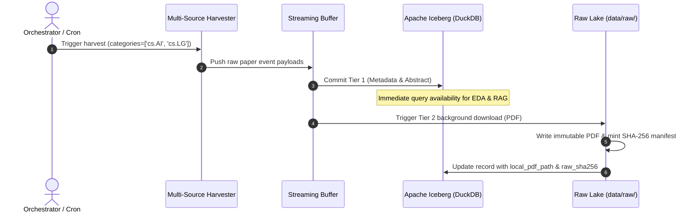

# 01_REALTIME_COLLECTION_AND_LAKEHOUSE.md — Phase 1 Technical Specification

- **Motivation/Background**: Building an advanced Retrieval-Augmented Generation (RAG) system and extracting exploratory data mining patterns requires a continuous, high-volume stream of scholarly papers from multiple academic repositories without data corruption or schema drift.
- **Purpose**: Define the technical specifications, input/output data contracts, streaming event architecture, and Apache Iceberg Lakehouse schemas for Phase 1 (Real-Time Harvesting & Lakehouse Vault).
- **Overview Pipeline**: Real-time harvesters query arXiv RSS/API and OpenAlex → push events to a streaming buffer → two-tier ingestion consumer commits metadata instantly to Apache Iceberg and vaults raw PDFs with SHA-256 manifests into `data/raw/`.
- **Detailed Plan**: §1 Scope & Acceptance Criteria; §2 Input & Output Data Contracts; §3 Execution Architecture & Flow; §4 Technical Specification, Edge Cases & Error Recovery; §5 Associated Links.
- **References**: [agents/rules/MD_CONVENTION.md](../../agents/rules/MD_CONVENTION.md), [agents/rules/AGENT_AI.md](../../agents/rules/AGENT_AI.md), [docs/references/ML_PIPELINE_REFERENCE_v4.md](../references/ML_PIPELINE_REFERENCE_v4.md), [01_COLLECTION_HANDOFF_GUIDE.md](01_COLLECTION_HANDOFF_GUIDE.md), [docs/references/Chapter1.pdf](../references/Chapter1.pdf), [docs/references/Chapter2.pdf](../references/Chapter2.pdf).
- **Created**: 2026-09-30T13:01:59+07:00
- **Last Updated**: 2026-09-30T13:14:30+07:00

[STATUS: ACTIVE]

---

## Metadata

- **Phase ID**: `PHASE-01`
- **Phase Name**: Multi-Source Real-Time Collection & Apache Iceberg Lakehouse
- **Status**: Active Specification
- **Target Modules**:
  - `src/crawlers/` (arXiv RSS/API, OpenAlex collectors)
  - `src/streaming/` (Event queue, buffer, retry manager)
  - `src/storage/` (Apache Iceberg Lakehouse, DuckDB SQL, raw file vault)

---

## 1. Scope & Objective

### Background
In accordance with the UTH Data Mining syllabus ([docs/references/Chapter1.pdf](../references/Chapter1.pdf) §Data Pipeline and [docs/references/Chapter2.pdf](../references/Chapter2.pdf) §Collection), data collection and ingestion represent 60–80% of project effort. This phase establishes the production-grade data foundation: continuously harvesting AI, Machine Learning, and Data Science papers, guaranteeing the **Immutable Raw Invariant**, and structuring metadata in an **Apache Iceberg Lakehouse** queryable via **DuckDB**.

### Goals & Acceptance Criteria
- [ ] **Multi-Source Crawlers:** Modular extractors for arXiv (`cs.AI`, `cs.LG`, `cs.CL`, `stat.ML`) and OpenAlex API with polite rate-limiting.
- [ ] **Two-Tier Ingestion Strategy:**
  - *Tier 1 (Instant):* Ingest paper metadata and abstracts immediately into Apache Iceberg for sub-second search availability.
  - *Tier 2 (Async Background):* Stream raw PDF downloads to `data/raw/papers/` with SHA-256 provenance manifests.
- [ ] **Apache Iceberg Lakehouse:** Formulate Iceberg table format via PyIceberg with SQLite catalog and DuckDB SQL query interface.
- [ ] **Deduplication & Idempotency:** Ingesting the same paper twice updates existing records or skips safely without duplicate row insertion.
- [ ] **Zero Data Leakage:** Ensure raw files remain strictly read-only and no statistics leak into downstream partitions.

### Explicit Non-Goals
- Phase 1 does **NOT** build RAG prompt generation or execute clustering/topic models (these belong to Phases 2, 3, and 4).

---

## 2. Input & Output Data Contracts

### 2.1 External Ingestion Sources
1. **arXiv RSS & Query API:**
   - Base Endpoints: `https://rss.arxiv.org/rss/cs.AI+cs.LG+cs.CL+stat.ML` and `http://export.arxiv.org/api/query`.
   - Rate limit: Strictly $\ge 3.0$ seconds between consecutive requests.
2. **OpenAlex REST API:**
   - Endpoint: `https://api.openalex.org/works?filter=concepts.id:C41008148,from_publication_date:2026-01-01`.
   - Polite Pool: Custom `User-Agent: UTH-DataMining-Agent (mailto:researcher@uth.edu.vn)`.

### 2.2 Lakehouse Table Schema (`papers_metadata`)

The Apache Iceberg table stores normalized paper metadata:

| Field Name | Type | Description | Nullable? |
| :--- | :--- | :--- | :--- |
| `paper_id` | `StringType` | Canonical identifier (e.g. `arxiv:2401.12345` or OpenAlex ID) | No (Primary) |
| `title` | `StringType` | Cleaned paper title | No |
| `abstract` | `StringType` | Paper abstract text | Yes |
| `authors` | `ListType(StringType)` | List of author full names | No |
| `published_date` | `TimestampType` | Publication timestamp (UTC ISO 8601) | No |
| `updated_date` | `TimestampType` | Last revision timestamp | Yes |
| `categories` | `ListType(StringType)` | Subject categories (e.g. `['cs.AI', 'cs.LG']`) | No |
| `primary_category`| `StringType` | Main subject classification | No |
| `doi` | `StringType` | Digital Object Identifier | Yes |
| `pdf_url` | `StringType` | Canonical remote link to PDF | Yes |
| `local_pdf_path` | `StringType` | Path to downloaded file under `data/raw/papers/` | Yes |
| `raw_sha256` | `StringType` | SHA-256 cryptographic hash of raw PDF | Yes |
| `citation_count` | `IntegerType` | Citation count from OpenAlex | Yes |
| `source` | `StringType` | Originating source (`arxiv`, `openalex`) | No |
| `ingested_at_utc` | `TimestampType` | Ingestion timestamp | No |

### 2.3 Raw Vault Manifest (`data/raw/manifests/<paper_id>.json`)
```json
{
  "paper_id": "arxiv:2401.12345",
  "source_url": "https://arxiv.org/pdf/2401.12345.pdf",
  "local_path": "data/raw/papers/arxiv_2401.12345.pdf",
  "sha256_checksum": "e3b0c44298fc1c149afbf4c8996fb92427ae41e4649b934ca495991b7852b855",
  "byte_size": 1542890,
  "ingested_at_utc": "2026-09-30T13:01:59Z",
  "status": "VAULTED"
}
```

---

## 3. Execution Architecture & Flow



### Command-Line Usage Pattern
```bash
# 1. Harvest latest AI/ML papers from arXiv into streaming queue
python -m src.crawlers.arxiv_crawler --categories cs.AI,cs.LG --limit 50

# 2. Ingest stream into Apache Iceberg Lakehouse
python -m src.streaming.consumer --run-once

# 3. Query lakehouse metadata via DuckDB CLI / Python
python -m src.storage.lakehouse_db --query "SELECT count(*), primary_category FROM papers_metadata GROUP BY primary_category"
```

---

## 4. Technical Specification, Edge Cases & Error Recovery

1. **arXiv Rate Limit Compliance:**
   - Enforce minimum delay `time.sleep(3.0)` between requests.
   - If HTTP 429 occurs, execute exponential backoff with jitter: $2^{\text{attempt}} + U(0, 1)$.
2. **OpenAlex Polite Pool:**
   - All outgoing headers must supply `User-Agent` with contact mailto.
3. **Network Drops & Resilient PDF Ingestion:**
   - If a PDF download times out, mark `download_status: PENDING` in the queue and retry up to 3 times before routing to `data/quarantine/`.
4. **Idempotent Writes & Deduplication:**
   - Use `paper_id` as the primary key. Before writing raw files or Iceberg rows, check if `paper_id` already exists.
5. **Data Lakehouse Persistence:**
   - The PyIceberg catalog is persisted locally in `data/lakehouse/catalog.db` (SQLite) pointing to Parquet data files in `data/lakehouse/iceberg/`.

---

## 5. Associated Links

- Master Research Index: [docs/README.md](../README.md)
- Living Roadmap: [docs/OVERVIEW.md](../OVERVIEW.md)
- Project Strategic Brief: [docs/PURPOSE.md](../PURPOSE.md)
- Canonical Engineering Reference: [docs/references/ML_PIPELINE_REFERENCE_v4.md](../references/ML_PIPELINE_REFERENCE_v4.md)
